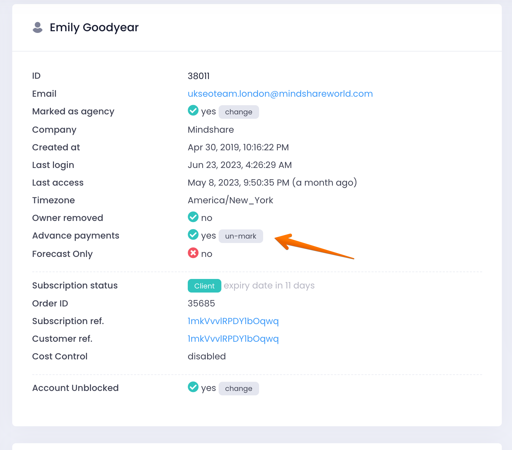

# A client switched from prepaid to monthly payment - what should we do?

> **Collection:** Customer Success
> **Last Modified:** 2023-07-06
> **Tags:** annual billing, billing, financial, Ioana, monthly, prepaid

---

Once a client no longer wants the prepaid option and goes for the monthly payments, we have to disable in Admin the prepaid option for their account.

