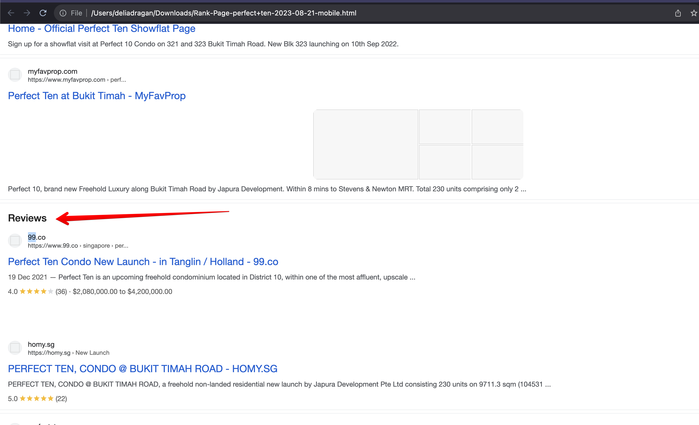

# Are reviews considered organic results in SEOmonitor?

> **Collection:** Customer Success
> **Last Modified:** 2023-08-29
> **Tags:** Delia, organic result, ranks, reviews, SERP

---

Yes, they are, here's an example:

Internal info:

They are not SERP features. The reviews section on mobile is just a grouping, the results there are in similar positions on desktop and on mobile do not appear anywhere else 

If we wouldn t consider them organic you would be on 10 on desktop and 99+ on mobile.
