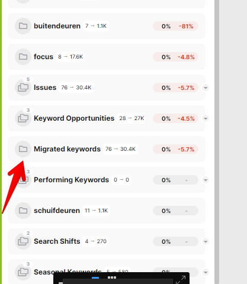

# Automatically-created groups for imports

> **Collection:** Customer Success
> **Last Modified:** 2024-08-19
> **Tags:** folder, group, import, magic keywords, Sulejman, wizard

---

- `Automatically Sourced`
  - holds the keywords that are discovered during the campaign setup wizard ("magic")

- `Initial Import`
  - keywords that the user added in the campaign setup wizard, via CSV file or manual input 

- `[date] Automatic Import`
  - keywords discovered with the automatically-sourced keyword option in the Rank Tracker, example below:

- Keyword Research Keywords?

- `Migrated Keywords`
  - keywords imported through the historical data migration process (see below)

- [date] Manual Import <--> now sunsetted option
  - keywords added via CSV or manual input from the Edit Mode in the Rank Tracker, prior to 2024
