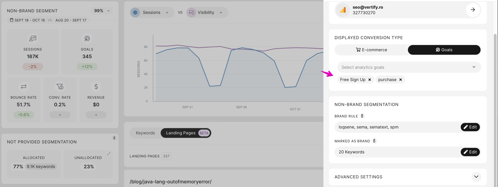

# Cases when conversions/values from GA4 cannot be retrieved through the Google API

> **Collection:** Customer Success
> **Last Modified:** 2023-10-24
> **Tags:** Andreea, api, conversions, ga4

---

There's a bug in GA4 API that prevents us from retrieving data for certain goals.

Conversions/Values for events with names containing any characters other than **"letters, numbers, or _"** cannot be retrieved through the API as it throws out an error: 

This was reported here more than a year ago here- [https://support.google.com/analytics/thread/176551995/conversion-event-api-calls-should-use-event-id-not-name-sessionconversionrate-conversion-event-name?hl=en](https://support.google.com/analytics/thread/176551995/conversion-event-api-calls-should-use-event-id-not-name-sessionconversionrate-conversion-event-name?hl=en), and a few other times on stackoverflow, with no resolution for now.

**Example from client's campaign:**

The client had only the **"Free Sign Up"** event selected and due to the bug from GA4 API that prevents us from retrieving data for it he got no goals in the campaign.

Once the second goal was added: `purchase`, the data started coming through the Google API. As they don't have any `purchase` event conversions and no other events, keeping them all selected didn't affect the resulting data.

By keeping all of them means (both goals) we won't try to fetch individual event `conversions:*`  metrics, but the `conversions` **aggregated total metric, which works fine in the API**.
