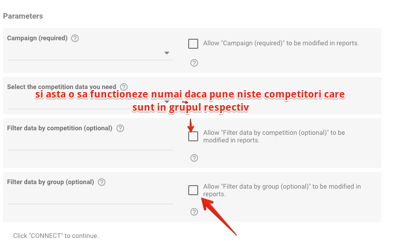

# Data Studio - Competition connector - modify in report options

> **Collection:** Customer Success
> **Last Modified:** 2021-04-06
> **Tags:** competition insights, connector, data studio, datastudio, Delia, google data studio, Ioana, report

---

The option to allow "filter data by group" to be motified in reports is removed.

Users will continue to be able to select the group before creating the report, when setting the parameters (endpoint, campaign, group, etc.)

Also, the option to allow "filter data by competition" to be modified in reports will only work if the competitors that will be become replacements are also allocated to that group within SEOmonitor.

