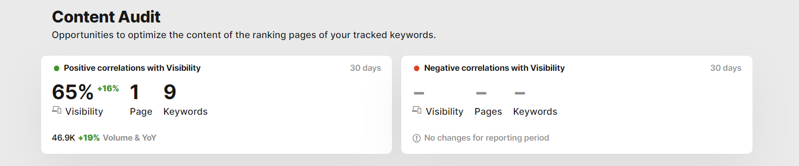

# Details about the Visibility correlations in Content Audit 

> **Collection:** Customer Success
> **Last Modified:** 2023-08-09
> **Tags:** content audit, Ioana, visibility correlations

---

There will be data showing in Content Audit if Landing Pages with negative or positive impact were affected by content changes.
So you can have pages where the Visibility dropped, but they will not be present in Content Audit under "correlations with Visibility" unless they were affected by a content change. 

As for the "-", we are not showing trends under 0.1 in absolute.

