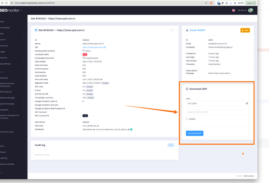

# Downloading SERPs not working for campaigns with changed URL

> **Collection:** Customer Success
> **Last Modified:** 2024-11-18
> **Tags:** campaign, changes, SERP, URL

---

If the campaign has changed URLs, and the new URL is ranking on those days you request the SERP download, the SERP download validation fails (due to the SERP having a different rank for the campaign URL than the stats).

[internal info only] You can download the SERPS from the admin instead, as there's no validation there.

The customer cannot download them while the stats rank does not match the rank we detect on the SERP at the moment of download, and that is by design.

Related task: [https://app.clickup.com/t/8696ngkch](https://app.clickup.com/t/8696ngkch)
