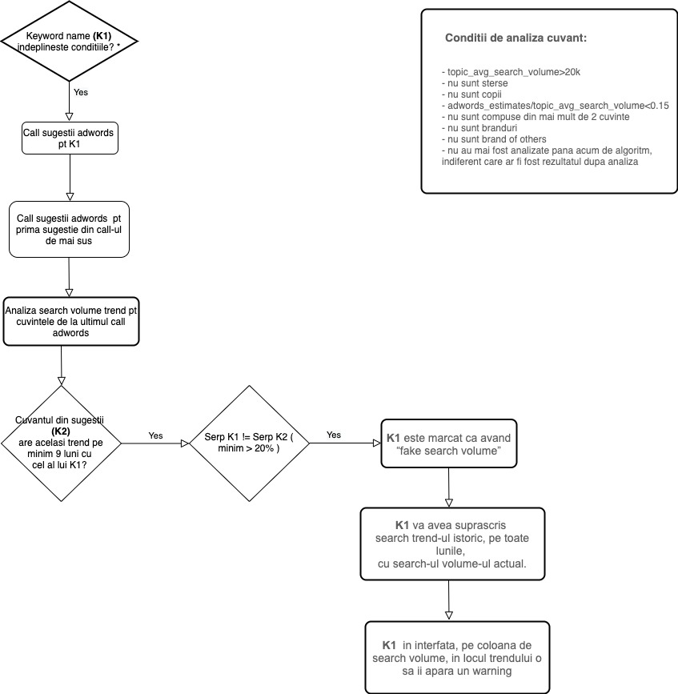

# Fake Search Volumes algorithm

> **Collection:** Customer Success
> **Last Modified:** 2021-01-29
> **Tags:** algorithm, Fake, Fake Search Volumes, Fake Search Volumes algorithm, Ioana, search volume

---

Se analizeaza cuvantul **hote**, pentru SID=**11875**

**1.** se face un call la adwords pt sugestiile “**hote**”, cu parametru de locatie (in caz ca acea campanie este localizata)

**2.** callul de mai sus o sa returneze urmatoarele rezultate, ca si sugestii

```
`	        - hote in english``                - hotera ``	        - hotwire deutsch``	        - mote hote``	        - red hote`
```

**3.** mai departe, cu primul cuvant din lista de mai sus, se face acelasi call de mai sus, la adwords, in care se cer sugestiile, in cazul nostru, cerem sugestiile pentru hote in english


**4.** call-ul de mai sus o sa returneze urmatoarele rezultate:

```
`	- hotels``	- hote meaning in english``	- sab ek jaise nahi hote in english``	- kash aap yahan hote in english``	- jhoot k paon nahi hote in english``	- jhoot ke paon nahi hote in english``	- hote english``	- jhoot ke pair nahi hote in english`
```


- 
pentru cele doua call-uri de mai sus, pe langa sugestii pentru fiecare cuvant in parte, adwords o sa returneze si search trend-ul pe 1 an


**5. **se ia search trendul pentru cuvantul analizat, adica pentru `**hote**`

**6.** se analizeaza search trendul fiecarui cuvant returnat din ultimul call de la adwords

- 
daca se gaseste un trend al oricarui cuvant returnat la pct. 4 care sa fie acelasi pe minim 9 luni cu trendul cuvantului initial analizat **hote**, atunci acest cuvant este analizat mai departe. 
In cazul nostru, am identificat cuvantul “**hotels**”


**7.** Sunt analizate cuvintele **hote** si** hotels**

- 
**7.1 **Se identifica serp-ul fiecarui cuvant.

- 
**7.2** Se analizeaza doar primele 20 rezultate din serp

- 
**7.3** Daca **serp-ul lui hote** difera fata de **serp-ul lui hotels**, in proportie mai mica de 20%, atunci:

  - 
**7.3.1** hote este marcat ca avand “fake search volume”

  - 
**7.3.2** hote va avea suprascris search trend-ul istoric, pe toate lunile, cu search-ul volume-ul actual.

  - 
**7.3.3** in interfata, pe coloana de search volume, in locul trendului o sa ii apara un warning care va avea urmatorul tooltip:


```
`	We have identified that this keyword is now reported in AdWords as being aggregated under hotels, which gives it the wrong value: 60,500 monthly searches. We have, in turn, proceeded with giving it another AdWords-based value: the number of monthly impressions that it would get, if you would place the maximum bid on it. `
```

Unde 60,500 monthly searches este search volume-ul cuvantului “**hotels**”

- 
ce inseamna asta: adwords “vede” ca “**hote**” are acelasi search volume cu “**hotels**”

- 
doar ca cele doua cuvinte inseamna cu totul altceva

- 
cu acest algoritm, incercam sa nu atribuim search volume-ul de la **hotels** catre **hote**



