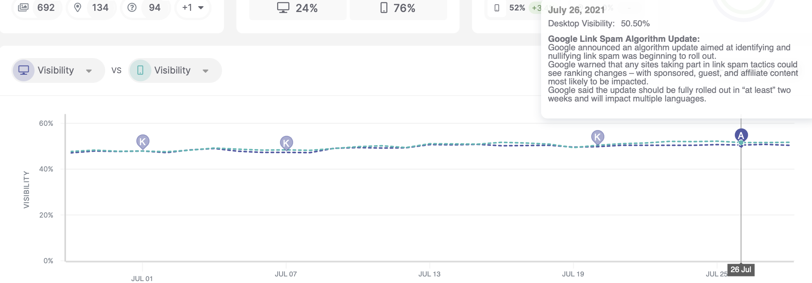

# G​oogle algorithm updates

> **Collection:** Customer Success
> **Last Modified:** 2021-07-28
> **Tags:** algorithm, algorithm update, Andreea, annotations, google, graph annotation, Rank Tracker, signals, updated

---

When Google releases a new update that we detect, we add annotations to the chart to inform users about it.  

H​ere is how they show on the graphic: 

They can impact the performance of a campaign so it’s important to let them know. 

Signals also provides that information to the user under the form of that card. Y​ou can see an example of how these updates appear in Signals: [https://take.ms/1hqWn](https://take.ms/1hqWn)
