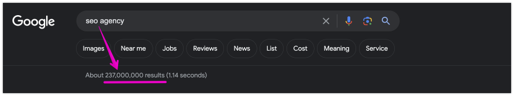
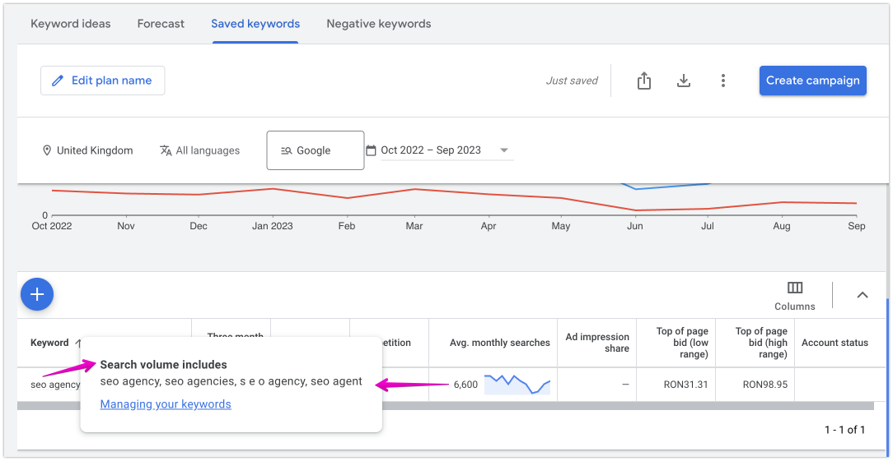

# How do we select the Main keyword in an Aggregation?

> **Collection:** Customer Success
> **Last Modified:** 2023-10-26
> **Tags:** Ads, adwords, aggregates, aggregation, double check, google ads, main keyword

---

### The newest version:

This one is looking at the **number of results on the SERP page**. 

The main/parent would have the highest number of results.

AND: a **misspelling** will never be considered main, it's always child/aggregate.

### 
The initial version:

_Later edit: we no longer use the Ads Forecast anywhere._
The main/parent keyword in an aggregation would be the one that has the **highest number of impressions in Ads** - and this can be checked in the Forecasts tab: [https://take.ms/e2vGN](https://take.ms/e2vGN)

_Still valid:_
In the Historical metrics tab, you can check if, indeed, those keywords are part of an aggregation. The table there will display only the first keyword you added when doing the research, and the proof of an aggregation comes from having all of the others appear in the pop-up over that keyword.

