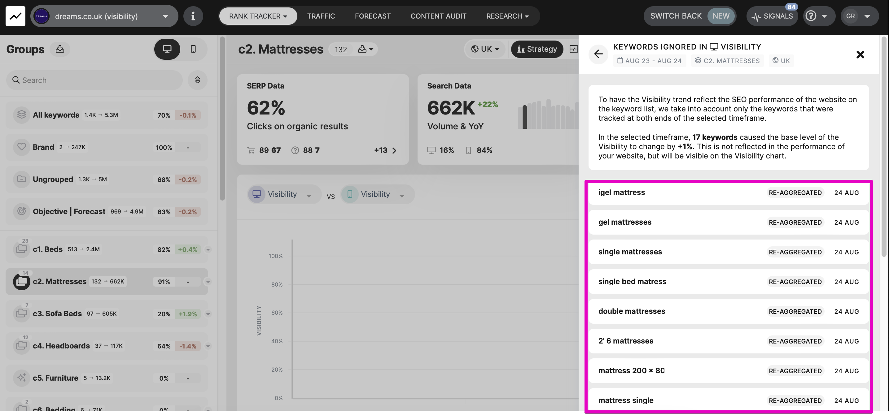
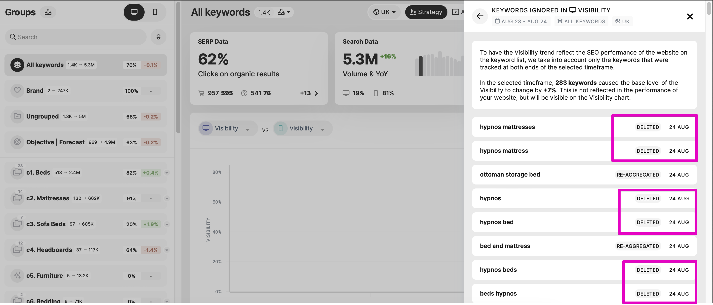
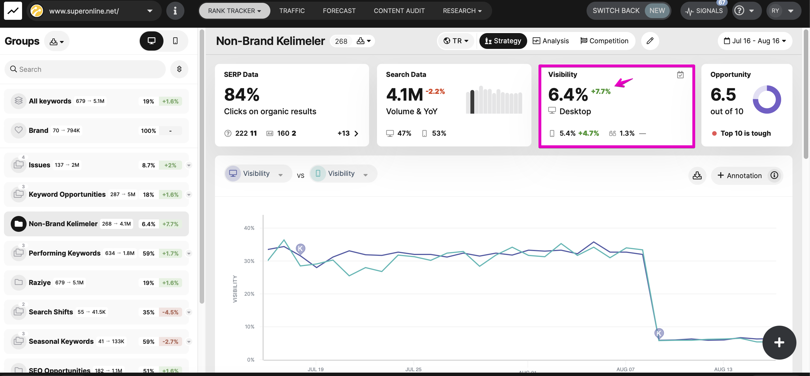
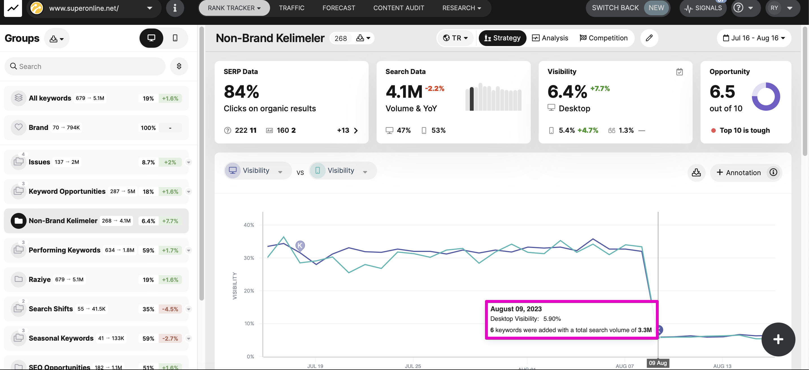

# How does adding/removing keywords influence the Visibility Change?

> **Collection:** Customer Success
> **Last Modified:** 2023-09-12
> **Tags:** Andreea, archive, explainer, group, group visibility, keywords, visibility

---

When you **remove keywords from a group or archive** them all together, the Visibility is recalculated retroactively. 
This also affects the baseline, so the action has no influence on the Visibility Change, as it will be as if the keywords were never tracked.

So the removed/archived keywords will not be present in the performance explainer as excluded keywords, as it's the case for All keywords:

 

**Adding to the group** keywords that are already tracked in the campaign has the same behavior.

However, if the **keywords are new to the campaign**, they will affect the group's performance the same way as for All Keywords.
This means that they will not influence the Visibility historically, and they will be displayed in the baseline explainer.

In the event that** the keyword has been tracked, then archived, then reactivated,** the Visibility should be calculated retroactively according to the data they stored, and if the selected timeframe includes a day without data, they should be present in the baseline explainer.

### **________________________________________________________________________________**

### **Can you have a visibility change higher than the VALUE OF THE DAILY visibility?**

The answer is **yes**.

This is because the Visibility Change is performance-related therefore it's calculated for the keywords that were present for the entire interval (at both ends of the timeframe).

In this example, there were 6 keywords added during the selected timeframe that caused a drop in the daily visibility (or **chart** trend) but did not influence the Change.

So **the daily Visibility and the Visibility Change can be calculated for different lists of keywords**, depending on the keyword movements throughout time. And the second one is not always the mathematical difference of the first one.
