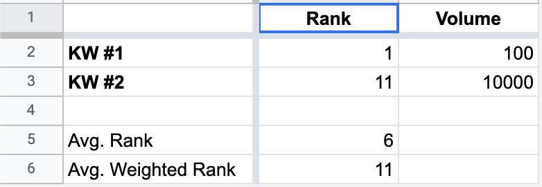

# How does the average rank weighted by the search volume work in the Forecast module?

> **Collection:** Customer Success
> **Last Modified:** 2022-05-30
> **Tags:** average ranks, Delia, forecast, Forecast configuration, search volume, target rank

---

It represents the average rank on the keywords' searches.
Since the target ranks are a maximum of top 10, the CTR curve becomes less important in this formula, meaning that you can compare average ranks to their target ranks instead of Visibility to target ranks.

Let's take the following example:

The average rank represents the average between KW#1 and KW#2 = 6 - which doesn't give us a picture of the searches done on the keywords.

The average weighted rank represents (KW#1 * KW#1's SV + KW#2 * KW#2's SV) / (KW#1's SV + KW#2's SV) - which also takes into consideration the searches done on the keywords.
