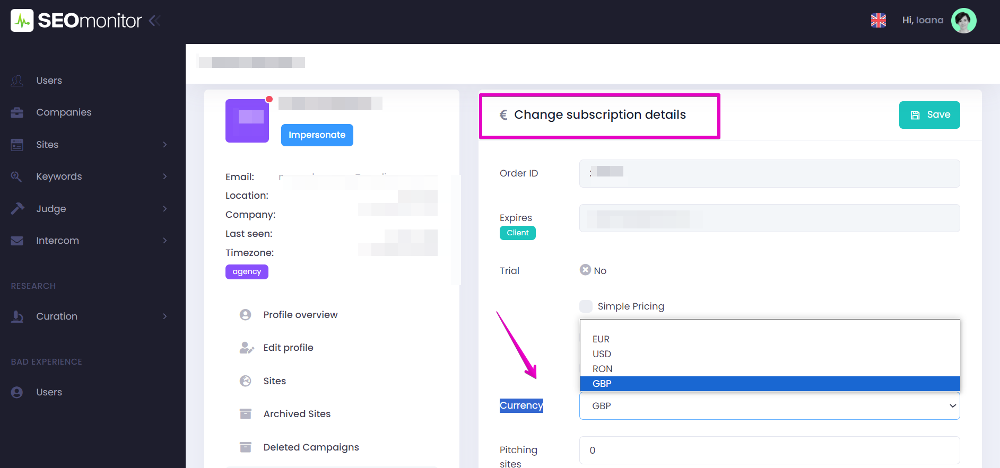
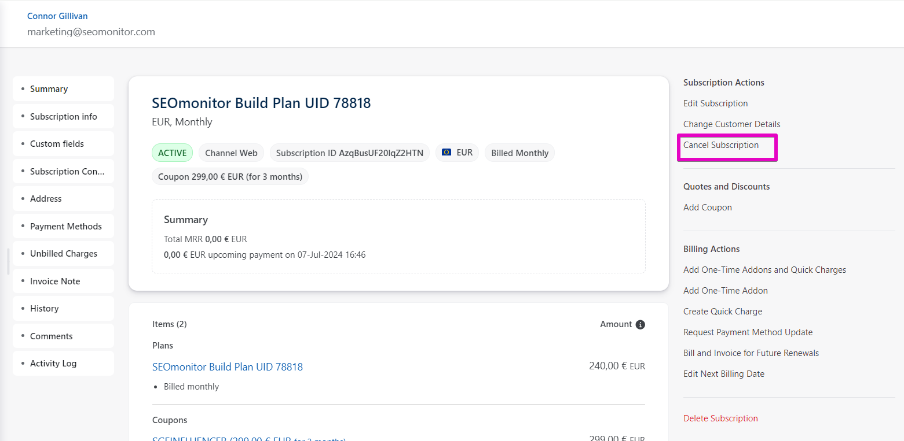
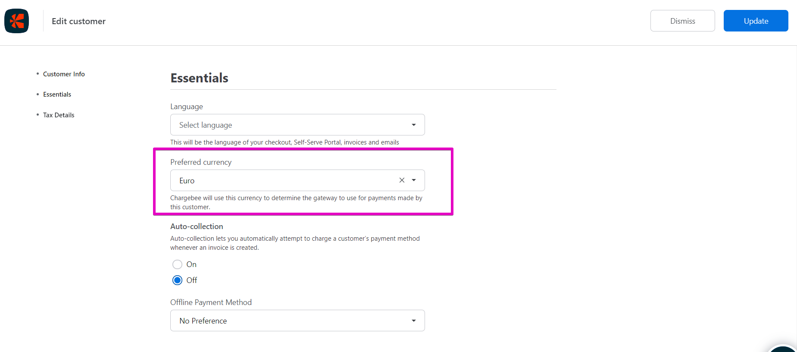

# How to change subscription currency

> **Collection:** Customer Success
> **Last Modified:** 2024-06-28
> **Tags:** change subscription, change subscription currency, currency, Ioana, subscription, subscription currency

---

**TO BE DONE ONLY IF THERE'S NO WAY TO CONVINCE THE CLIENT TO STICK TO THE INITIAL CURRENCY**

When the client subscribes to a certain currency & then asks to be updated to a different one, the steps are as follows:

1. **Change the currency in Admin** -> Change subscription details -> Currency 

1. **Cancel the current subscription in Chargebee** -> select Customer -> select Subscription -> Cancel subscription button in the right sidebar.

1. **Change currency in ChargeBee -> **select** **Customer -> Edit Customer button on the right sidebar.

1. **Create a new subscription** -> select Customer -> Create new subscription button on the right sidebar.
(more details here - [**Creating (manual) subscription for (in-trial) accounts**](https://app.getguru.com/card/T8RMaXXc/Creating-manual-subscription-for-intrial-accounts))

1. **Add the plan for the new currency to the subscription.**

*Sometimes, the plan for the new currency might not be available immediately. 
 Be patient; it will show up in 30 minutes or so.
