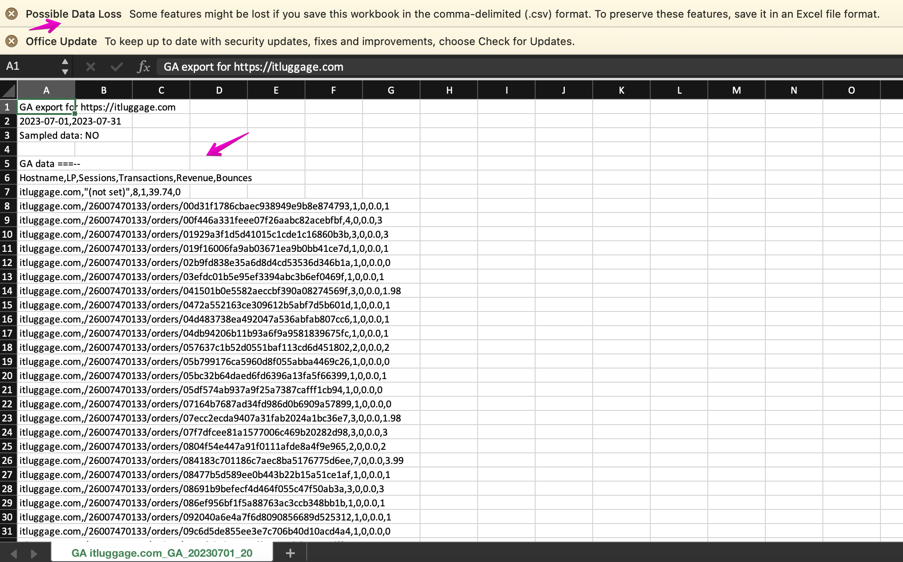
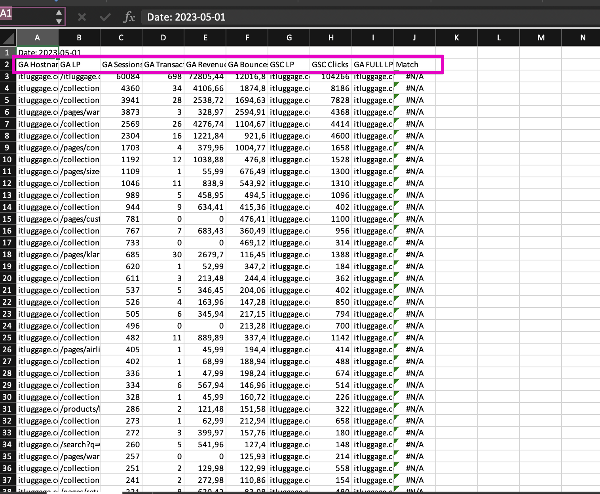

# How to check traffic exports integrity before using them in the analysis

> **Collection:** Customer Success
> **Last Modified:** 2023-08-31
> **Tags:** Andreea, export, organic traffic, traffic, traffic export

---

Before double-checking the information from the Organic Traffic with the traffic exports from Admin for GA, GSC, or GA/GSC, you should **try opening them with Excel (or Numbers)** to check if they have been corrupted.

Corrupted file when opened with Excel:

Healthy file:

