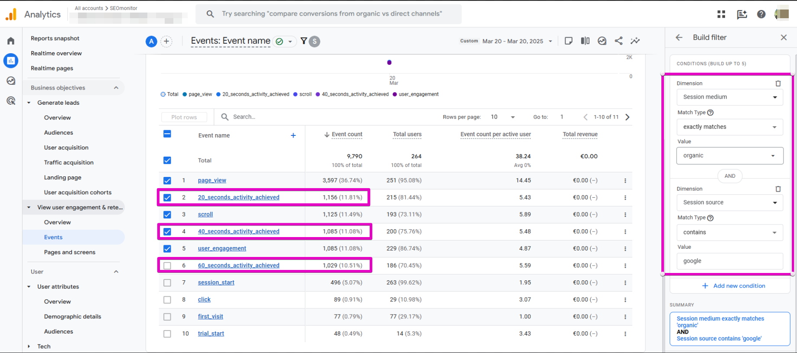
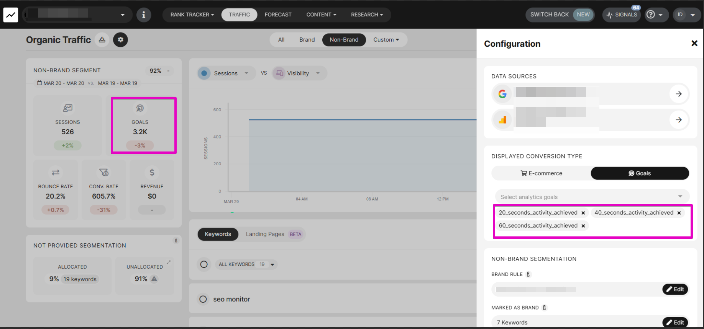
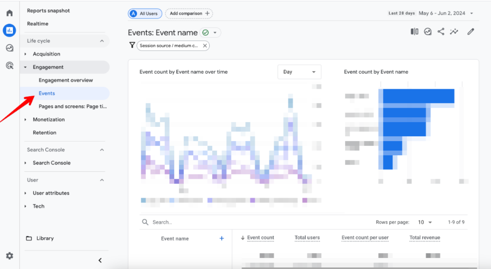
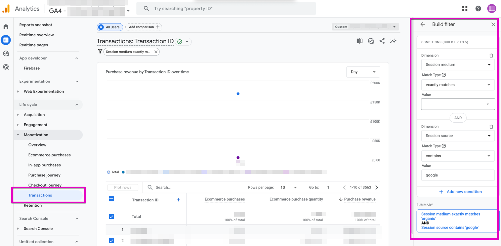
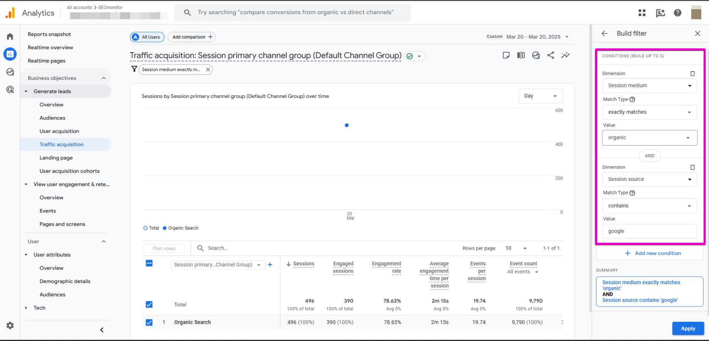

# How to check traffic in Google Analytics (GA4)

> **Collection:** Customer Success
> **Last Modified:** 2025-04-03
> **Tags:** check analytics, check GA, compare GA, filter GA, Ioana, M test

---

For any GA report you're checking, **you have to apply** the below **filtering**:

- Session medium `exactly matches` _organic_

AND

- Session source `contains` _google_

You will select different report categories depending on the metric you're checking.

If you're set for **Goals**, you'll check [**Conversions**](https://support.google.com/analytics/answer/9356034?hl=en) and their corresponding Revenue on Engagement / User Engagement -> Events.
Depending on the setup, you'll compare the total or the sum of each metric for the events you selected to track in SEOmonitor with the Goals/Revenue widget value.

 

 

If you're set up as an [**Ecommerce**](https://support.google.com/analytics/answer/14430645?hl=en&sjid=9221411183040296797-EU), you'll check the **Transactions** and their corresponding Revenue under Monetization -> Transactions.

****

**Sessions** will be checked under Traffic Aquisition for both Ecommerce and Goals setup.

**Note**: It is best to check **day by day** to avoid sampling. 
So, compare one day from GA with one from the platform and/or exports.

*You might want to check these cards as well:
[Why does my (localized) campaign show more traffic than the GA4 profile?](https://app.getguru.com/card/igG5jjnT/Why-does-my-localized-campaign-show-more-traffic-than-the-GA4-profile)
[Why do I see more sessions in SEOmonitor than in my Google Analytics profile?](https://app.getguru.com/card/cLe5R7Xi/Why-do-I-see-more-sessions-in-SEOmonitor-than-in-my-Google-Analytics-profile)
