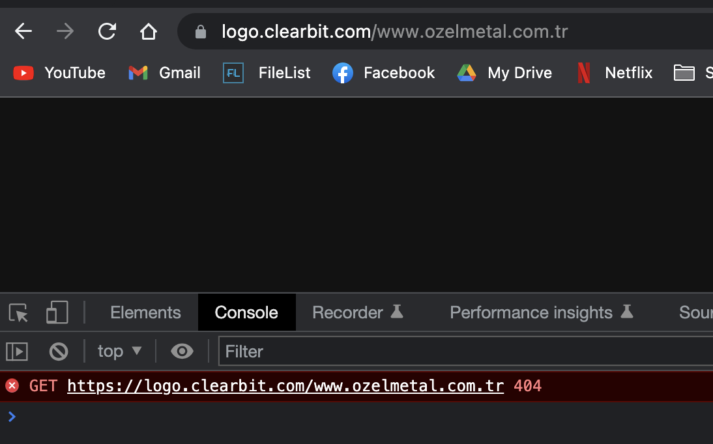

# How to confirm Clearbit doesn't return a logo for a website

> **Collection:** Customer Success
> **Last Modified:** 2024-02-12
> **Tags:** check clearbit, check logo, clearbit, Ioana, no logo

---

For all campaigns with no logo, Clearbit returns a 404.

This can be verified using `https://logo.clearbit.com/www.sitename.com` while having the console open as well (right click on webpage-inspect-choose console tab)

Related card: [Logos/Favicons in SEOmonitor](https://app.getguru.com/card/c5aAAqbi/LogosFavicons-in-SEOmonitor)

Task source for info: [https://app.clickup.com/t/861mtavun](https://app.clickup.com/t/861mtavun)
