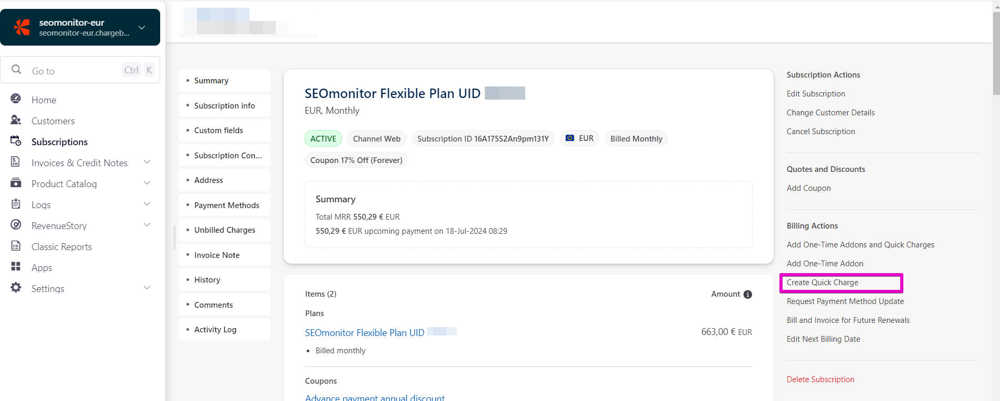

# How to create a manual prepaid invoice in ChargeBee

> **Collection:** Customer Success
> **Last Modified:** 2024-10-14
> **Tags:** chargebee, Ioana, manual prepaid, manual prepaid invoice, one-time charge, prepaid invoice

---

To create a manual prepaid invoice in ChargeBee, use the Quick Charge option **after you select the subscription**.

**If the client still has credit**, you must add that amount to the new one. 
This is because the Quick Charge feeds from the credit.

e.g.

Existing credit = EUR 2300

New downpayments = EUR 1500

Total value for the quick charge = 3800

**Beware of active coupons, as they'll also be automatically applied.**

More details about manual subscriptions here [Creating (manual) subscription for (in-trial) accounts](https://app.getguru.com/card/T8RMaXXc/Creating-manual-subscription-for-intrial-accounts)
