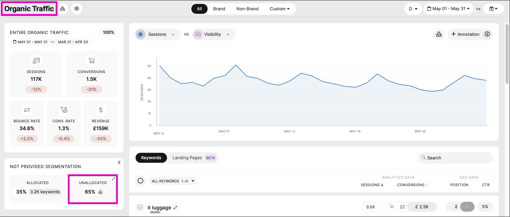
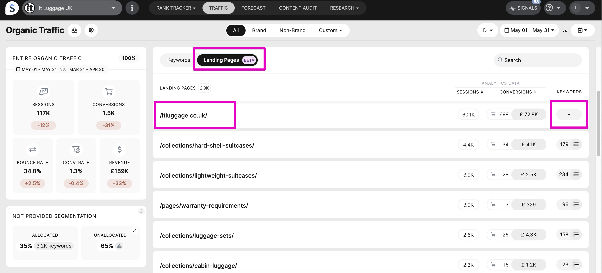
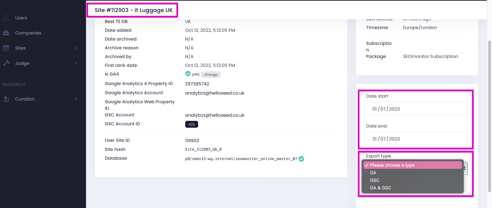
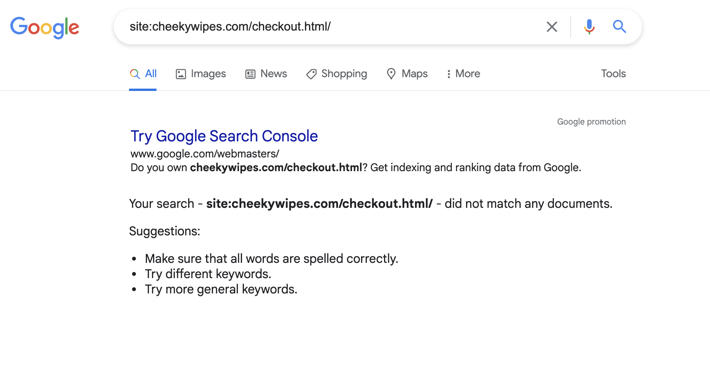
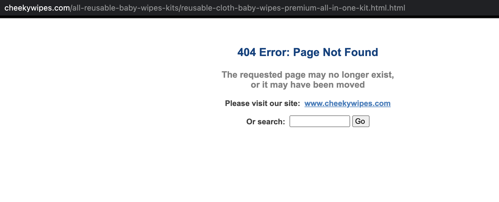
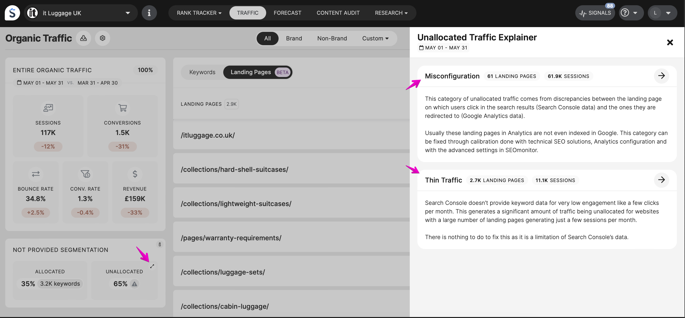
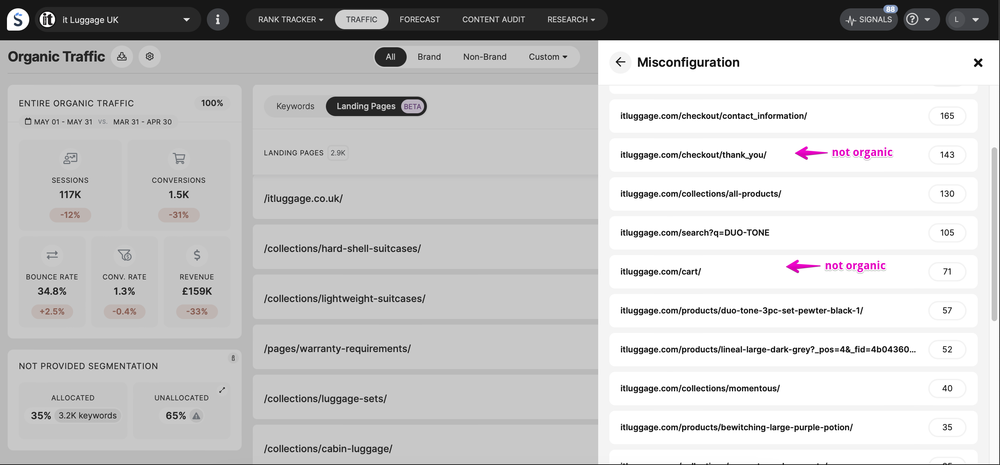
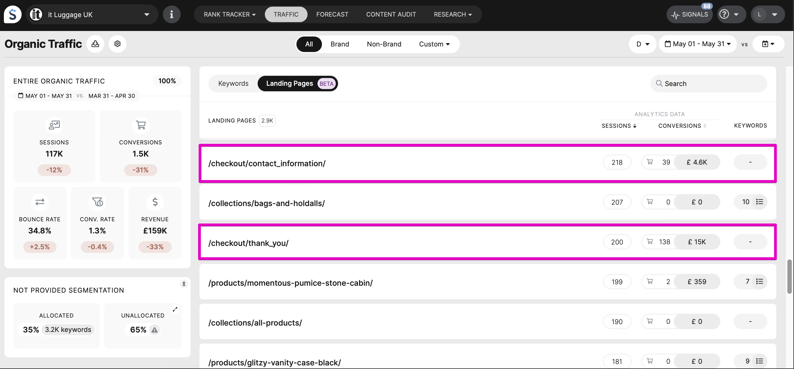

# H​ow to look into a campaign with high unallocated traffic - 2 different scenarios

> **Collection:** Customer Success
> **Last Modified:** 2023-08-31
> **Tags:** Andreea, landing page, LP, organic result, organic traffic, session, traffic, unallocated

---

T​here can be multiple reasons why a campaign can have a higher unallocated traffic. 

**H​ow do we check the un-allocated traffic?**

L​ooking first in the app into the Traffic Module, we can identify the percentage of unallocated traffic (rule of thumb: under 30% unallocated is ok):

A​fter that, to investigate what was not distributed (allocated), we go on **All keywords** and look into the **Landing Pages view**:

Note that the correct way to investigate is to look at it on a **day-by-day** basis!

O​n the Landing Pages view,  we check the pages that have under Keywords: **N/A (-)**. These are pages that we could not match from GA to GSC, so the traffic data on them is not distributed into keywords.

To be able to understand better why these pages weren't matched, we can then export the data from Traffic Module for GA, GSC and GA/GSC together. We place all the information in different tabs of an excel to be able to compare the information regarding the LPs:

Please see b​elow an example of two scenarios that we can identify by looking into the LP's with N/A.

1​. When a large number of sessions being registered to **subdomains:**

For example _app.futrli.com_, _app.futrli.com.au_ or _do.futrli.com_ → out of a total of 205 for the day only 106 sessions could_ _be distributed (by matching the connected GSC and the LP data in it)

**→ **Solutions in this case would be:

1. Connect additional GSC accounts, for each subdomain, or a sc-domain: profile;
1. Change the GA with one that is filtered to bring only the traffic for the main domain;
1. A third option would be for us to filter the traffic in SEOmonitor directly (only the main domain). Please bear in mind that this would cause the totals to look different than in GA.

Depending on what their desired outcome is (and the goals with the client or how they want to manage the campaign), they can go for the 1st option if they need to have the full traffic (all subdomains) distributed. The 2nd option (or the 3rd option as backup), if they only need to track the traffic for the main domain.

2​. Product pages (either too old or too new content) - that Analytics still sees, but they’re no longer (or not yet) present in GSC – and pages that seem to not be organic traffic, such as /checkout or /cart.

The two main issues here are:

1. There are sessions on LPs that should not be considered Google Organic traffic (that’s what we take from GA: google+organic) and “mixed” in that section of GA, for example: pages like _/basket_ or_ /checkout_. These aren’t in GSC, because they also aren’t (or shouldn’t be) indexed:

(no organic query would lead us to that. ( you can perform the search on Google with **site:**domain.com/checkout** **)

1. Some product pages (either too old or too new content) - that Analytics still sees, but they’re no longer (or not yet) present in GSC. Some of them also returning 404s :

**→ **Solutions in this case would be:

- Either they filter those _/basket_ or _/checkout_ pages directly in GA (if they have access to the client’s account or if they can advice the client to do so) and then connect the updated profile & view;
- Or we could exclude them from the distribution on our side;
- The 404s would need to be corrected on their side, we can exclude them, but not “in bulk”.

See here: 

and then 

