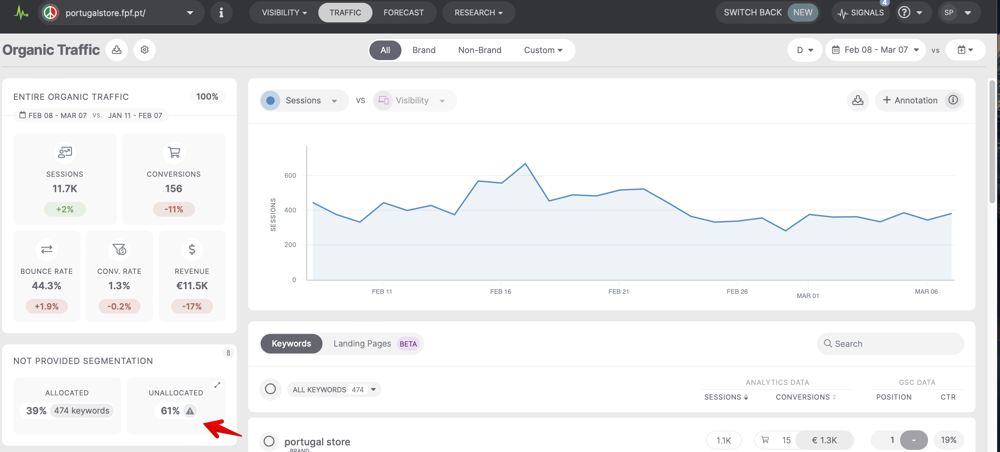
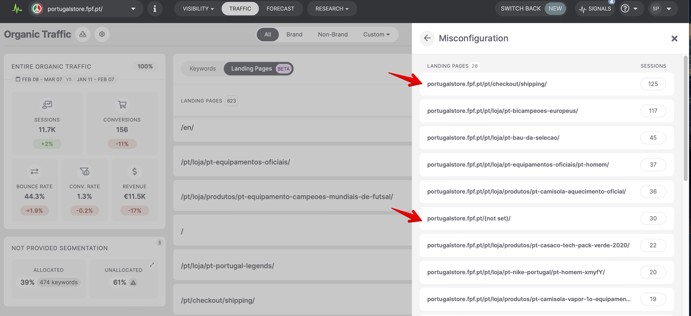
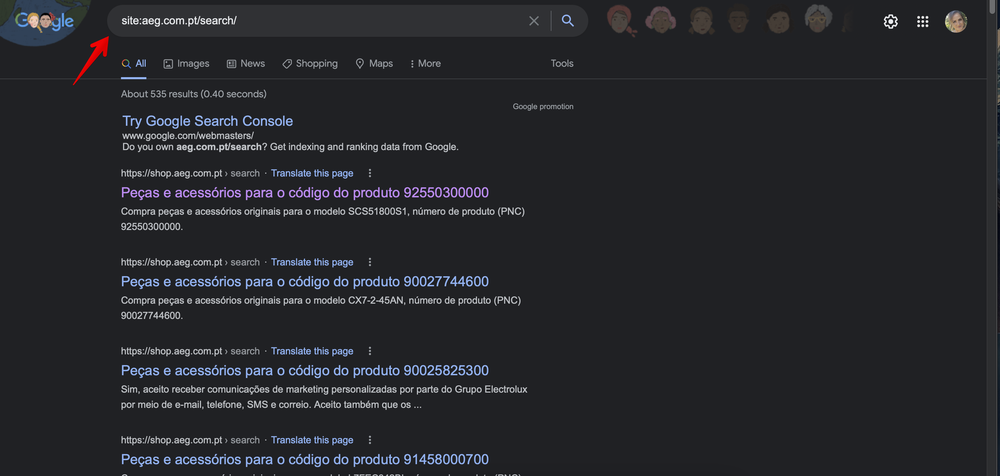
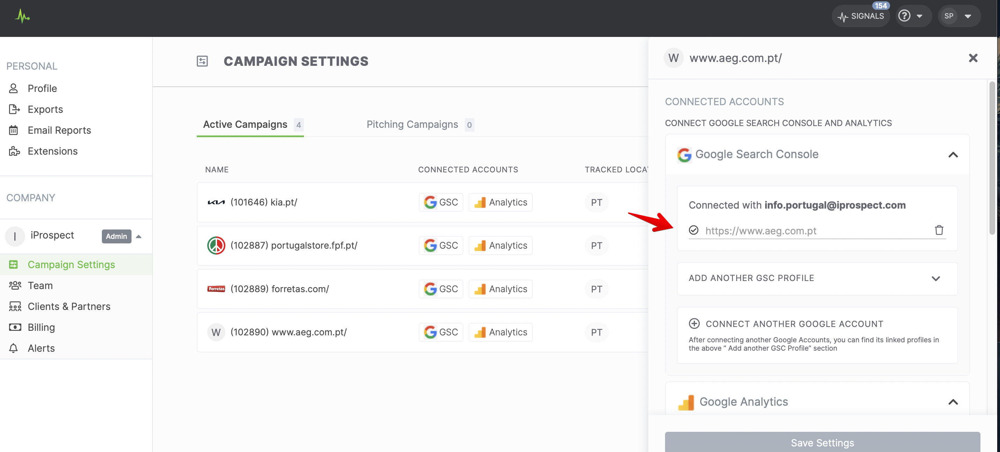
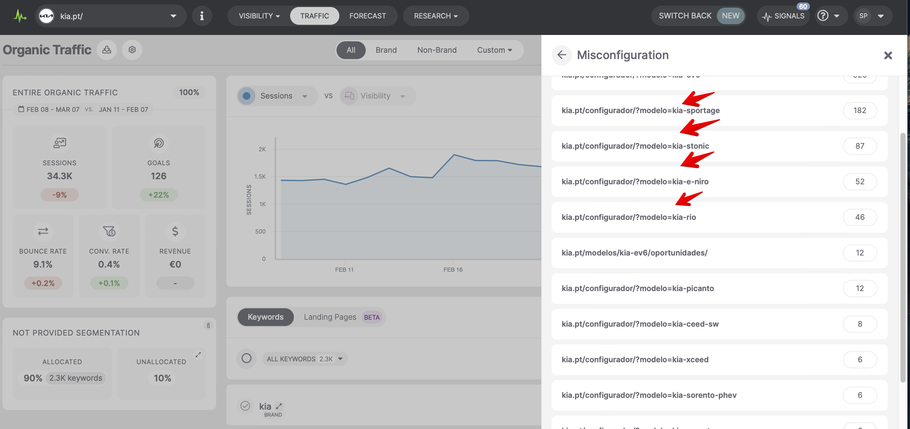
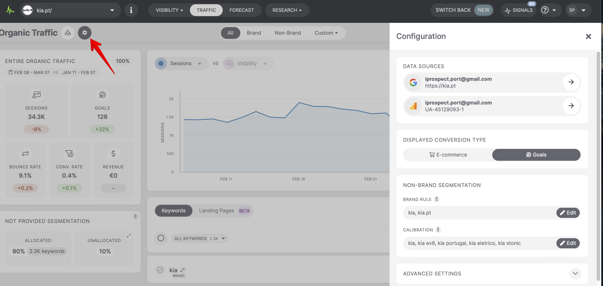
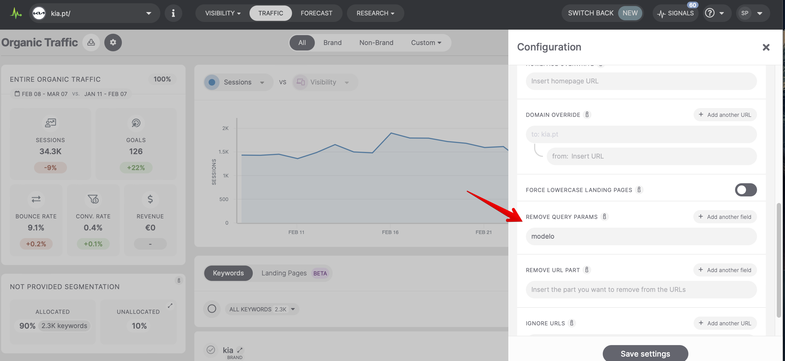

# O​rganic Traffic analyses - different scenarios

> **Collection:** Customer Success
> **Last Modified:** 2022-03-18
> **Tags:** analysis, Andreea, organic result, traffic, traffic data

---

When there is Unallocated traffic in the campaign higher than 30% (our generic rule of thumb is that if it’s below 30%, it’s good enough) there might be some adjustments that can be made to reduce it. 

Accessing the **Misconfiguration** you might be able to identify these issues:

W​e have pages that can be solved directly by the client in their Google Analytics account:

**→ **The **“not set”** page: **portugalstore.fpf.pt/(not set)/** can be solved in Google Analytics by following the steps from the [Google Article](https://support.google.com/analytics/answer/2820717?hl=en#zippy=%2Cin-this-article).

**→ **Also, pages like: **portugalstore.fpf.pt/pt/checkout/shipping/** or **portugalstore.fpf.pt/pt/checkout/success/** could be filtered directly from Analytics; they will most likely not show up in Search Console at any time, because they are not accessed as a result of an organic google search (one can see here that they are not indexed).

Another few ways to reduce the Unallocated are:

**→ **Tracking sub-domain traffic data:

The page: **aeg.com.pt/search/**, which shows up with 63 sessions, is not indexed in Google.

There is a subdomain with **shop.aeg.com.pt** that shows up on that query. In this case if you need to track the subdomain traffic data as well,  you'll need to connect a GA with data on both domains & the corresponding GSC profiles.

**→ **The landing pages that cannot be matched because they contain a query parameter, in this case "modelo" :

 Can be distributed by a custom setting in the Organic Traffic Settings:

→ Advanced → Remove query params: _modelo_. 

This will distribute the traffic from them into the main **/configurator** page and it would fix these 96 pages and their 781 sessions.
