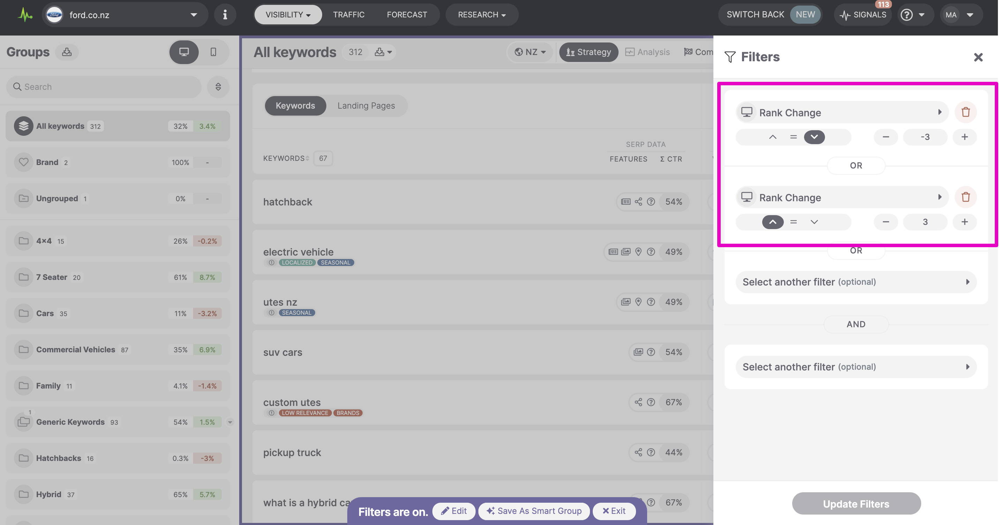
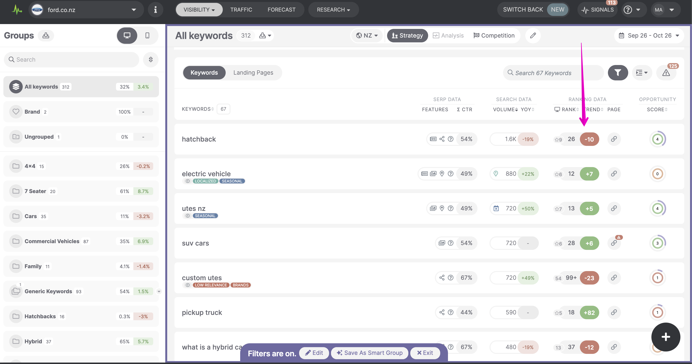
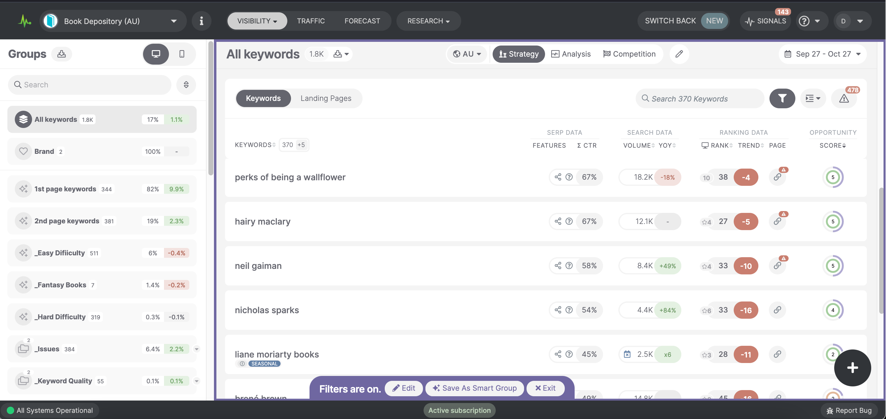

# Rank change and Rank change absolute in the new Rank Tracker v2

> **Collection:** Customer Success
> **Last Modified:** 2021-10-27
> **Tags:** changes, Delia, rank change, Rank Tracker, trend

---

- 
**Rank change absolute** can be obtained by using combined filters.
For example, if you want to see a rank change (trend change in the keyword table) bigger than 3 positions be it positive or negative (absolute 3), you can use this filter:

And the result would be this:

- 
**Rank change **- the operator functions mathematically so if you select a rank change lower than 3, you will be getting every change (trend change in the keyword table) lower than the number 3 - this includes changes of +1 or +2 as they are, mathematically speaking, lower than 3.

If you'd like to see just keywords that had rank drops lower than 3 and more you can use the rank change lower than -3 which will give you the results of all keywords that dropped 3 or more positions:

