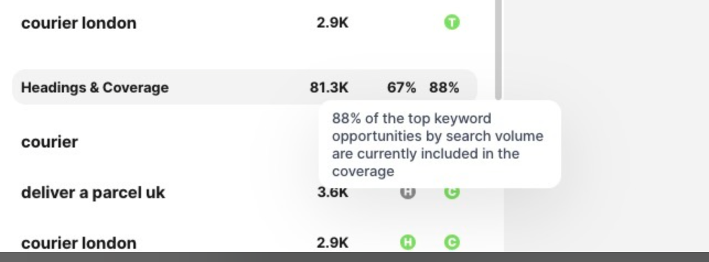

# SEO Score: Coverage metric  

> **Collection:** Customer Success
> **Last Modified:** 2024-08-07
> **Tags:** content writer

---

We are calculating the presence of keyword from the brief in articles/outlines' content part weighted by search volume measured in percentages. The tooltip from the keyword table header explains it better, than the coverage one. 

