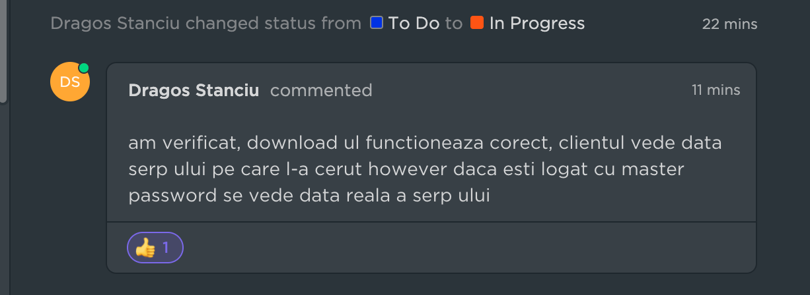

# SERP Download Date Difference

> **Collection:** Customer Success
> **Last Modified:** 2022-08-25
> **Tags:** check ranks, crawl, crawl frequency, Delia, internal, ranks, SERP, SERP date, serp download, serp page

---

**This is intended this way and it's internal information that should NOT be shared with the users.**

We skip crawling for some keywords such as close variants and the ones as shown in the algorithm [here](https://app.getguru.com/card/TnpbLKac/Algorithm-for-skipping-crawl).

When this happens, users will see the SERP download shown as from today's date but we will see the real one when downloading if we are logged in with masterpass.

If ever in doubt, use "impersonate" to see if it's functioning as above.

We only keep SERPs for 20 days, and if you're trying to download one that's missing, the SERP download endpoint logic goes like this:

- 
it tries to go a few days back and serve you the first one available before the date you requested 

- 
**if all else fails, it serves you the latest one we have**
