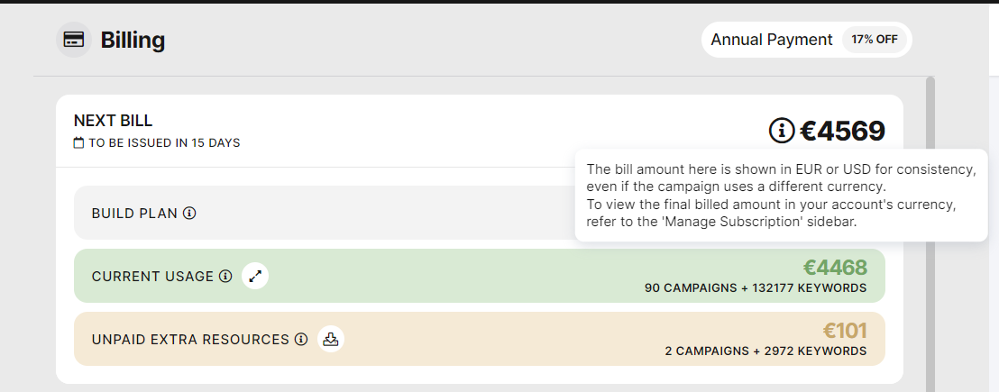

# The currency conversion for non-EUR subscriptions

> **Collection:** Customer Success
> **Last Modified:** 2024-07-24
> **Tags:** billing, chargebee, currency, currency conversion, exchange, exchange rate, Ioana

---

**I​n SEOmonitor, we show the price in EUR or USD, but in ChargeBee and Admin, we can also set GBP and RON.**

For the subscriptions set  for GBP or RON, there's a tooltip in Billing letting them know that

_The bill amount here is shown in EUR or USD for consistency, even if the campaign uses a different currency. To view the final billed amount in your account's currency, refer to the 'Manage Subscription' sidebar.
_

For all currencies, we make the exchange using [https://fixer.io/](https://fixer.io/) for the EUR -> [THEIR_CURRENCY] conversion rate available for the day the invoice is issued.
