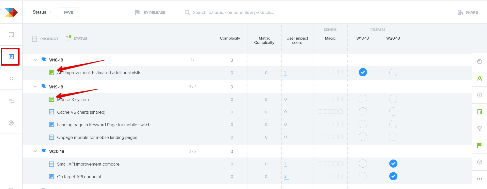
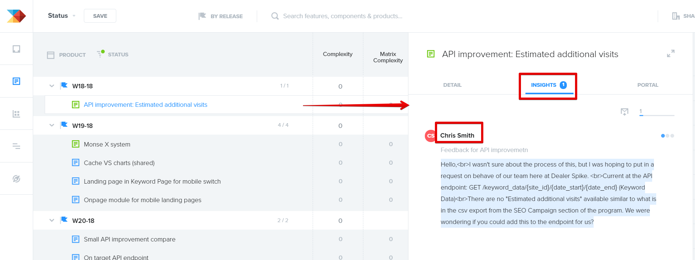
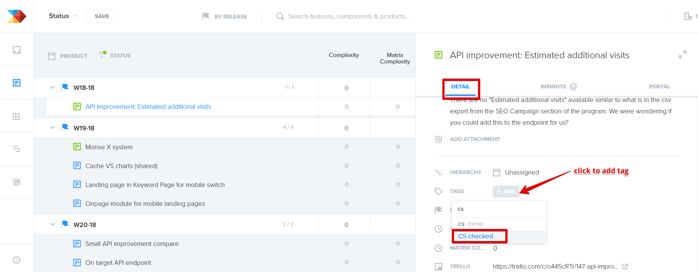

# Updating clients on the feature requests status (Productboard)

> **Collection:** Customer Success
> **Last Modified:** 2018-11-20

---

# (under consideration / in progress / launched)

Every couple of days, the CS team members (either in turns during the same day or each one, by rotation) need to check the Product Board to see if any new features are ready and inform the clients that requested them.

The same steps apply when a client asks for updates for a feature they requested. 

- 
log in to [https://productboard.com](https://productboard.com) using these credentials:

  - 
email: productboard@seomonitor.com

  - 
password: 

- 
go to [Features area](https://seomonitor.productboard.com/feature-board/8238-status)

  - 
check the ones in green (completed) or orange (in progress)

  - 
then click on them 

- 
once you are in the card view

  - 
click on Insights to find out who made the request, to let them know of any news

  - 
(if there are no insights, it means the request was from our team)

- 
after you've written to the client

  - 
add the "CS checked" tag to the card, to finalize the task and let the others know it's done, as shown below.

