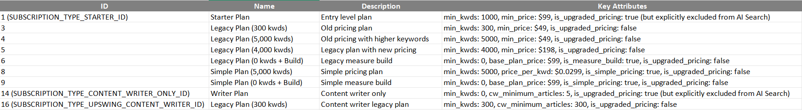

# What's considered a grandfathered plan when switching to Pro for AIS

> **Collection:** Customer Success
> **Last Modified:** 2025-09-15
> **Tags:** grandfathered, Ioana, switch for ai search, switch for ais, switch to pro

---

Engineering-wise, when switching to Pro for AI Search, the grandfathered plans are the ones that connect to the following subscription type IDs: 1,3,4,5,6,8,9,14,16

For Support, check the file [here](https://docs.google.com/spreadsheets/d/1yV6O6WU6_pg4MfSZV5SHt4_M8boqZCB69Tf3Qv_3o9M/edit?usp=sharing)

