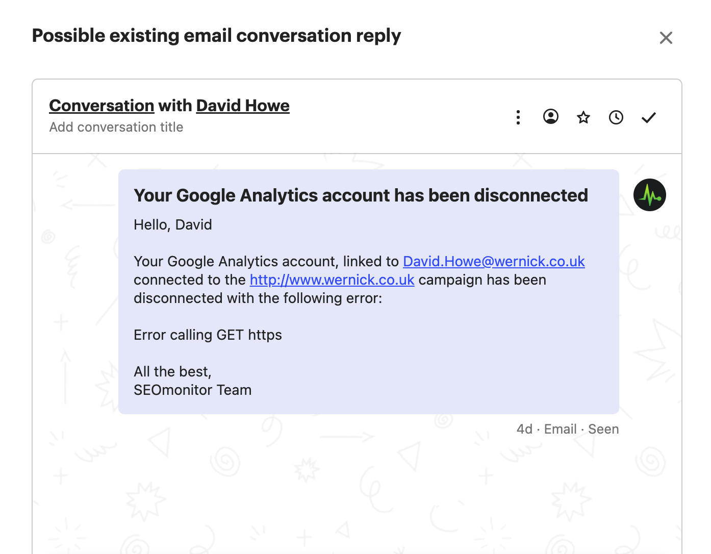

# What's the criteria for the GSC/GA disconnection alert email sent to users?

> **Collection:** Customer Success
> **Last Modified:** 2022-03-22
> **Tags:** alerts, Campaign Settings, Delia, GA, GSC

---

An automated email is sent to all admins of an account when our system identifies that any of the GSC/GA accounts disconnect from a campaign.

This is how the email looks like (for internal purposes, don't use this screenshot in conversations):

