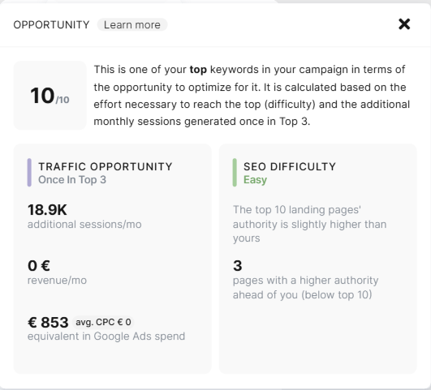
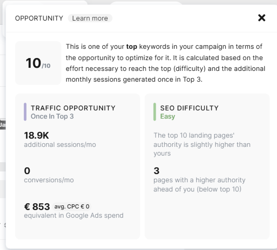

# When do we display additional conversions or additional revenue under the Opportunity metric?

> **Collection:** Customer Success
> **Last Modified:** 2025-01-15
> **Tags:** account, additional conversions, additional revenue, Andreea, conversions, Opportunity

---

Here’s how the Opportunity metric works for displaying additional conversions or additional revenue:

1. **E-commerce Accounts**:
  - If the account is set up for E-commerce (as shown in Settings and the Organic Traffic and Analysis Module), the Opportunity metric will display **Additional Revenue**.

1. **Goal-Based Accounts**:
  - The Opportunity metric will display **Additional Conversions** if the account is set up based on Goals.

