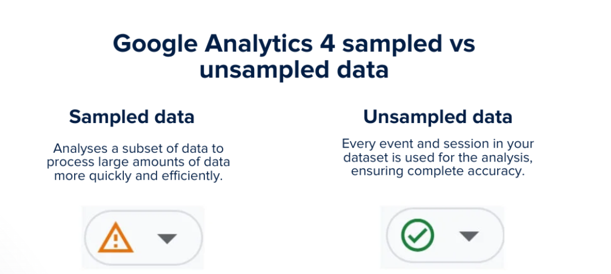
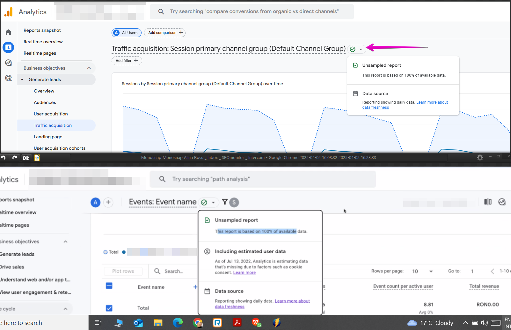
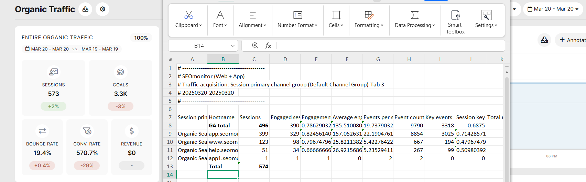

# Why do I see more sessions in SEOmonitor than in my Google Analytics profile?

> **Collection:** Customer Success
> **Last Modified:** 2025-04-03
> **Tags:** analytics, different number of sessions, different total sessions, GA, ga4, Ioana, M test, total sessions, traffic, wrong total sessions

---

There have been two instances (so far) when the number of sessions in SEOmonitor is higher than what GA is displaying.

The precise filter combination to use in GA:

- Session medium `exactly matches` _organic_

AND

- Session source `contains` _google_

## **Sampled data**

If you’ve been working with larger data sets, you might have noticed that your reports look a little off. 
That’s likely because GA4 sometimes uses data sampling to make things run faster by only analysing part of your data instead of the full set.

**GA4 has visual cues to indicate when your data is sampled or unsampled.** 

This info appears next to any default report name in GA, and the drop-down available next to it can provide some additional insights.

While Google samples the data in the Analytics interface, they provide full data through the API (our GA data source). And this is why you'll see higher numbers in SEOmonitor.

*External info sources [here](https://support.google.com/analytics/answer/13331292?hl=en) and [here](https://www.ruleranalytics.com/blog/analytics/google-analytics-data-sampling/#:~:text=GA4%20has%20visual%20cues%20to,you're%20actually%20working%20with.).

## **GA4 is summing sessions differently ("incorrectly")**

This is an issue widely noted, like, for example, [here](https://stackoverflow.com/questions/75723392/google-analytics-4-is-summing-sessions-incorrectly-why) and [here](https://webmasters.stackexchange.com/questions/142691/why-do-ga4-total-reported-sessions-not-equal-the-sum-of-sessions-by-dimension) and [here ](https://support.google.com/analytics/thread/207395654/why-doesn-t-the-session-default-channel-group-traffic-acquisition-data-add-up-to-the-session-total?hl=en)(though more often reported as "total" versus "sum by channels").

What happens is that there's a difference in total sessions not only between SEOmonitor and GA but even between the total in GA's interface and the total in their export, which provides data at a hostname/page level.

**How can you check if this is the case for you?**

- start by applying the proper filter,
- add the "hostname" column ("page+query string" can also work)
- then open the report as an exploration
- finally, export from exploration and make the total in the CSV 

[Monosnap Video 2025-04-02 19.2.mp4](https://content.api.getguru.com/files/view/80050f6b-2a2d-4f66-9c97-d0cbeb02795d)

     

While there's no official explanation, there are some hypotheses:

- _The difference in numbers may be a result of hyperlog-like optimization of data aggregation. In other words, plain simple summing might be too expensive for GA4 to conduct in that report, so it uses advanced algorithms that do sums faster but less accurate. _(from [here](https://stackoverflow.com/questions/75723392/google-analytics-4-is-summing-sessions-incorrectly-why#:~:text=Now%20back%20to,but%20less%20accurate.))
- When a user lands on a landing page, a timer starts for 30 minutes of activity known as a Session. During this session, whenever a user opens separate pages, these are called pageviews. So another theory is that the total comes from the actual sessions, while the sessions per page are rather pageviews.
- _In GA4, a session doesn't expire if a user returns to the website from a different source during an active session. It would still be one session, and both traffic sources would be in the same session._ (from [here](https://stackoverflow.com/questions/75907508/sessions-in-ga4-not-adding-up#:~:text=In%20GA4%20session%20doesn%27t%20expire%20if%20a%20user%20returns%20to%20website%20from%20the%20different%20source%20in%20the%20middle%20of%20active%20session.%20It%20would%20still%20be%20one%20session%20and%20both%20traffic%20sources%20would%20be%20in%20the%20same%20session.))

*External info about GA4's sessions and their challenges [here](https://measureschool.com/google-analytics-4-sessions/) and [here.](https://www.ruleranalytics.com/blog/analytics/google-analytics-sessions/)

**As internal info, you might also want to check:

- [How to check traffic in Google Analytics (GA, GA4, GA360)](https://app.getguru.com/card/iR9ynK5T/How-to-check-traffic-in-Google-Analytics-GA-GA4-GA360)
- [Understand how sampled data can affect your campaign](https://app.getguru.com/card/9ieyzEpi/Understand-how-sampled-data-can-affect-your-campaign)
[How to check traffic in Google Analytics (GA4)](https://app.getguru.com/card/iR9ynK5T/How-to-check-traffic-in-Google-Analytics-GA4)
