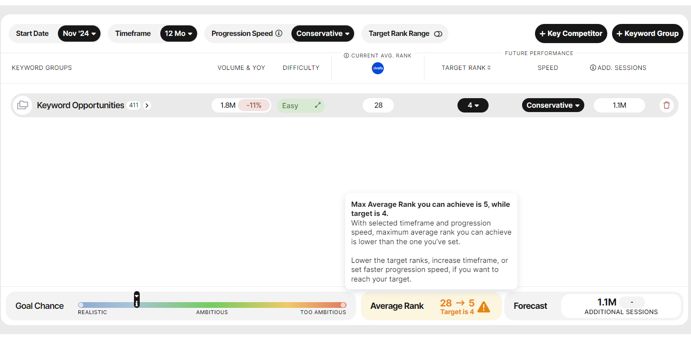
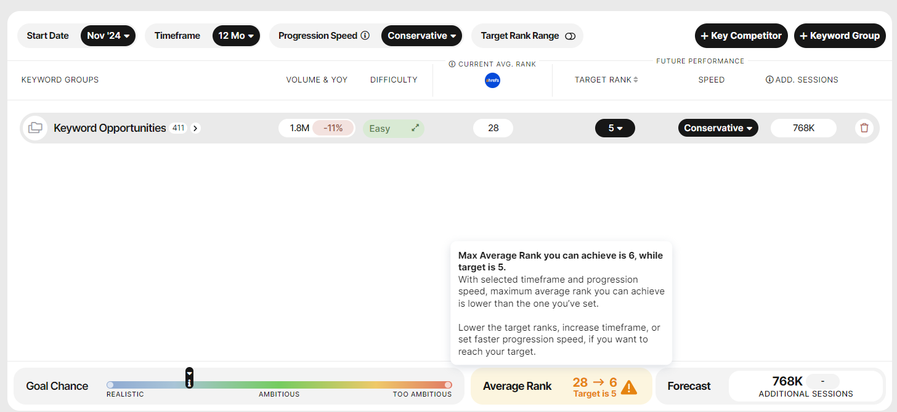

# Why do I still get a warning even if I lower my target to the level the higher target estimated to be achievable?

> **Collection:** Customer Success
> **Last Modified:** 2024-10-08
> **Tags:** forecast, Ioana, target, warning

---

There are instances in the Forecast where setting a higher target returns a warning, saying that you could only achieve a lower target.

But if you then select this lower estimated target, you still get the warning, aiming even lower now.

The estimated average target rank is based on the projected rank averages, which depend on:

- initial keyword rank
- target rank
- Search Volume
- number of forecasted months
- progression curves

So, the explanation for the above behaviour is that some of the keywords included in the calculation will never reach the target with the selected speed option, but, depending on where you set the target, the average will change. 
The roundings also play a significant role.
