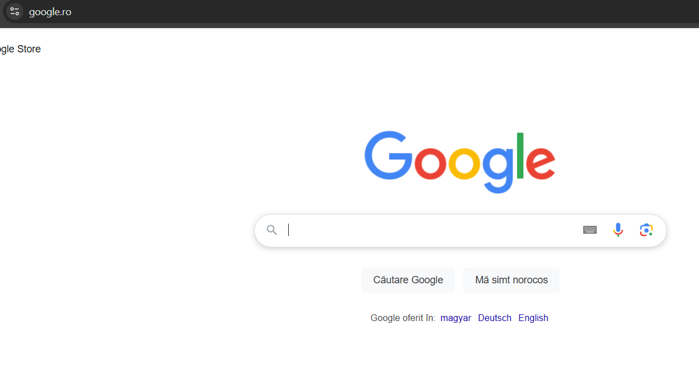

# Why does the Romania localisation has the EN language option but not DE or HU?

> **Collection:** Customer Success
> **Last Modified:** 2025-03-12
> **Tags:** Ioana, language, language for romanian market, M test, romanian localization, romanian market

---

For the google.ro engine, Google offers four languages: RO, HU, DE and EN.

The reason why we decided only to add EN, is that some sites are added on the Romanian market but written in English. 
In such cases, the Magic Keywords option would identify Romanian keywords because we ask AI to return keywords in the same language as the search engine indicates. 

So, the compromise was to add EN to Romania. 
This was done only for a very small and limited number of other countries (e.g. Switzerland) even though, in practice, an English website might be created for any market in the world.
