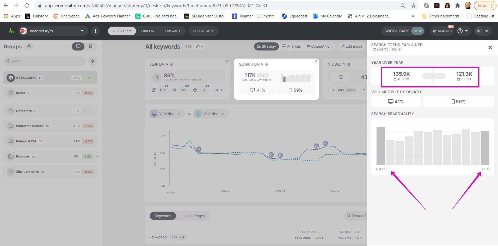

# Why does the YOY explainer only show 12 months?

> **Collection:** Customer Success
> **Last Modified:** 2021-09-27
> **Tags:** Andreea, cs, explainer, search volume, SV, YOY

---

An integrity check is made in the application for SV to display YOY.

 To display YOY for last month, we must have Search Volume for at least 90% of the active keywords in the campaign. 

If we don't have Search Volume for at least 90% of the keywords, we display YOY as shown below.

The date the SV is updated can fluctuate quite a bit.

