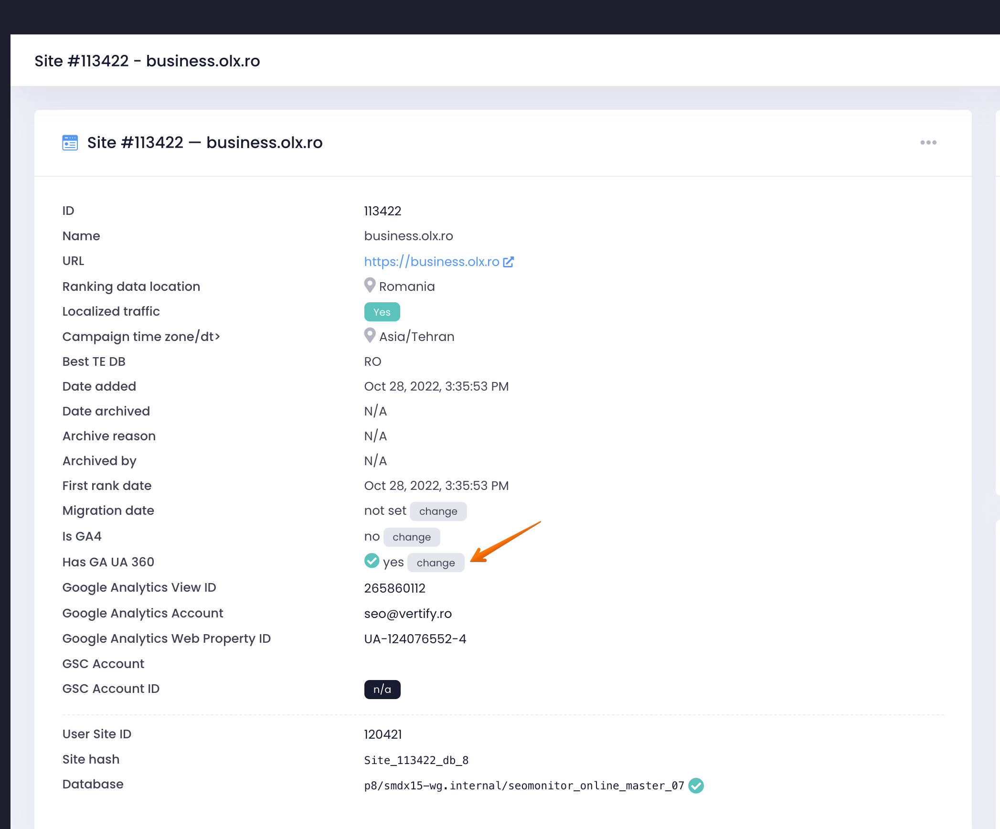

# Why there are sometimes big differences between the sessions in SEOmonitor and UA 360?

> **Collection:** Customer Success
> **Last Modified:** 2024-01-15
> **Tags:** admin, Campaign Settings, Delia, GA, traffic, UA, UA-360

---

The GA API sometimes returns the wrong data for longer intervals (so not the small differences that are normal but rather very big discrepancies between GA and SEOmonitor) but it retrieves them correctly for a single day.

We do have a solution for this, you can switch the user's campaign to UA 360 from admin, which will enable day-by-day processing only for this campaign and only for UA 360:

