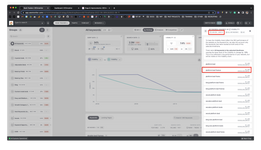

# W​hen do we assign "Google Ads Reaggregation" to keywords

> **Collection:** Customer Success
> **Last Modified:** 2023-10-10
> **Tags:** Andreea, explainer, google ads, keywords, labels, visibility change explainer

---

W​e assign this to keywords that have had a sudden change in Search Volume in Google Ads from one month to another from 10 to 1000 or from 1000 to 0, for example.

If a keyword has both re-aggregated and Google Ads Reaggregation we show it as Google Ads Reaggregation.

This usually happens when keywords get re-aggregated.

When more than one such event happens for a keyword, we only save the latest. This alters the Visibility for the days and timeframes when the previous ones happen because they get un-flagged. 

For example: We had a case where a keyword had multiple switches in a short period of time: 

16 - 26 May, the "platform bed frames" shows , an SV increase from 2.4k to 2.9K [https://take.ms/u2L0rN](https://take.ms/u2L0rN). 

27-28 May, it shows another increase from 2.9 to 90.5k [https://take.ms/9ENyw](https://take.ms/9ENyw) 

Then in June there was another event, which is the only one we can see in the explainer:

- This is up for discussion for Product Backlog [here](https://app.clickup.com/t/2g4ph7y).
