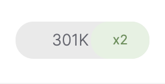
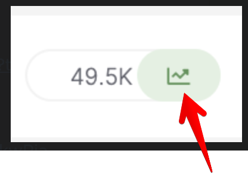

# YoY formatting - What is the rule we’re applying to express the YoY Search Trend metric

> **Collection:** Customer Success
> **Last Modified:** 2021-11-23
> **Tags:** Anca, Delia, Rank Tracker, Year over year, YOY, yoy trends

---

- 
Everything below +200% is represented in +-%.

- 
Everything between +200% and +999% is represented with x2-x10:

 

- 
Everything above +1000% is represented with an icon for trending icon (“newcomer”):

