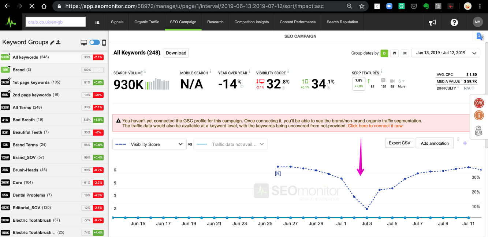

#  [ONBOARDING] Alex Case Study - SID: 58972

> **Collection:** Customer Success
> **Last Modified:** 2019-07-16

---

SID: 58972

NAME: oralb

CASE: Why do we have a huge drop in VS score?

RESPONSE:

- 
KWs have a huge amount of landing pages changes which caused the ranks to plummet from the 1st pages to 80+ thus losing all impression shares. 

- 
There are also multiple cannibalisation issues for the Landing Pages some of the most dominant KWs would respond to.

- 
KWs that were 1st/2nd page fell in ranks past the 2nd page with a very high amount of SV from the total of 930k.

OBSERVATIONS AFTER REVIEW:
