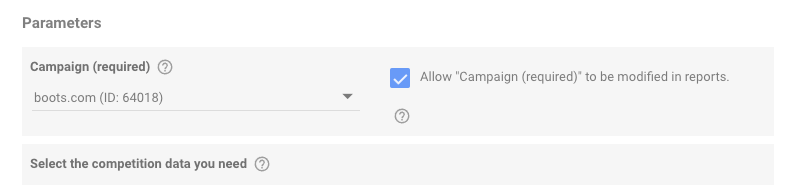
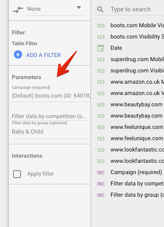

# how does the group name filter work in Google Data Studio?

> **Collection:** Customer Success
> **Last Modified:** 2021-02-12
> **Tags:** google data studio

---

This is a new thing in DS. Not sure why those are in the list of dimensions and metrics, but I can tell you that those are the parameters you marked when you created the data source “Allow ‘blabla’ to be modified in reports”

In the reports themselves, you can find them in the sidebar at “Parameters”

The parameters are “selects” or “text” inputs, depends on the type of input you first have in the configuration screen
